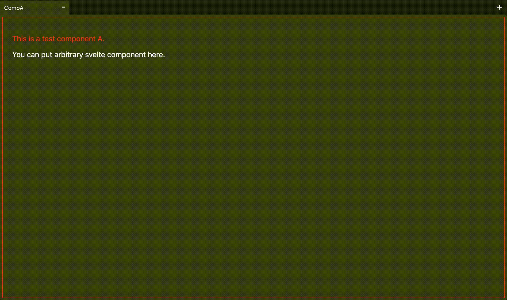
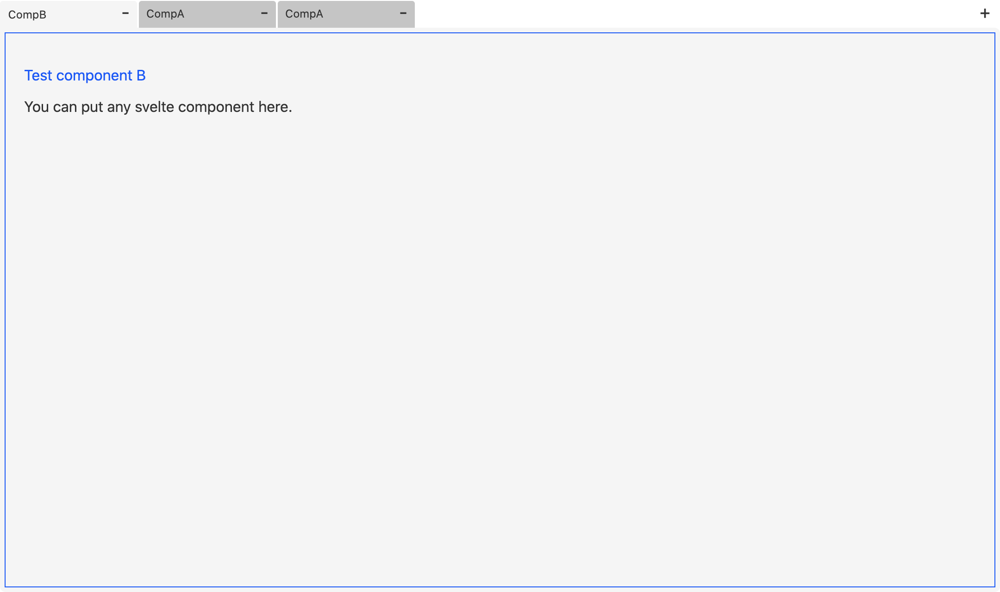
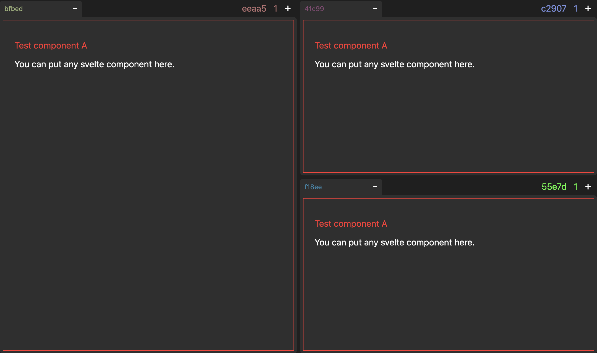

# Svelte-editor
Tab ui editor library for svelte.

Typescript is available. Follow the instruction [here](https://svelte.dev/blog/svelte-and-typescript).



## Usage
Import svelditor by npm.
```
npm i svelditor
```
Then in your app, All you have to do is defining components and rootFrame to start with.

```Svelte
<script>
import { root, Frame, Tab, components, Comp, FRM } from 'svelditor';

// import your components
import CompA from './CompA.svelte'
import CompB from './CompB.svelte'

// you will set your components here
components.set( [new Comp('CompA', CompA), new Comp('CompB', CompB)] );

// define root frame
const rootFrame = new Frame([], []);
rootFrame.tabs.push(new Tab('CompA', rootFrame.frames[0]));
root.init(rootFrame);
</script>

<!-- place tabs in absolute coordinate -->
<FRM x={0} y={0} w={720} h={480} bind:f={$root}/>
```

That's all!
## Options

Colors are changable.
```js
col_frame.set('clear');
col_tab_text.set('#111111');
col_tab_dflt.set('#c5c5c5');
col_tab_actv.set('#f5f5f5');
```



You can check uuid of a tab or a frame, with `debug` option enabled. (it's shortened for viewing)
```js
debug.set(true);
```



## License
[MIT](LICENSE)
